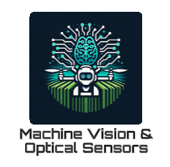

# MVOSLab ChatBot  



## 🚀 Overview  
**MVOSLab ChatBot** is a locally running AI chatbot powered by **DeepSeek-R1**, developed at **South Dakota State University's MVOS Lab**. The chatbot utilizes the **Ollama** framework to run AI models efficiently on your local machine.  

---

## 📥 Installation & Setup  

### 1️⃣ **Download Ollama**  
Ollama is required to run DeepSeek-R1. Download and install it based on your OS from the following link:  
🔗 [Ollama Official GitHub](https://github.com/ollama/ollama)  

### 2️⃣ **Download DeepSeek-R1 Model**  
After installing Ollama, open a command window and **download the DeepSeek-R1 model** of your choice.  

> **Note:** The model version you choose depends on your system's computing power. The **DeepSeek-R1:7B** model has been tested on a laptop with an **NVIDIA RTX 4070**.  

Run the following command in **Command Prompt (cmd)**:  

```bash
ollama run deepseek-r1:7b


